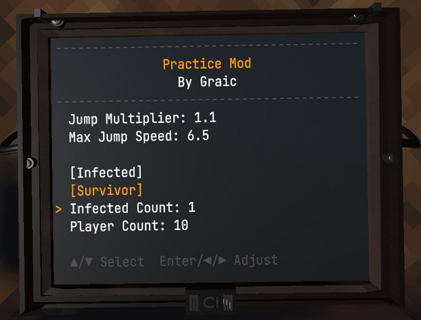

# Practice Mod
Gorilla Tag mod for practicing alone. **Only works in private matches where you are alone**.
Requires [ComputerInterface](https://github.com/ToniMacaroni/ComputerInterface) (1.4.0+) and [Utilla](https://github.com/legoandmars/Utilla) (1.3.0+)

Features:
* Simulate being a tagger or survivor with specific amounts of players tagged

* Set a checkpoint using the X button, and teleport using the A button

* Functionality can be toggled using the computer

## Disclaimers
This product is not affiliated with Gorilla Tag or Another Axiom LLC and is not endorsed or otherwise sponsored by Another Axiom LLC. Portions of the materials contained herein are property of Another Axiom LLC. ©2021 Another Axiom LLC.
